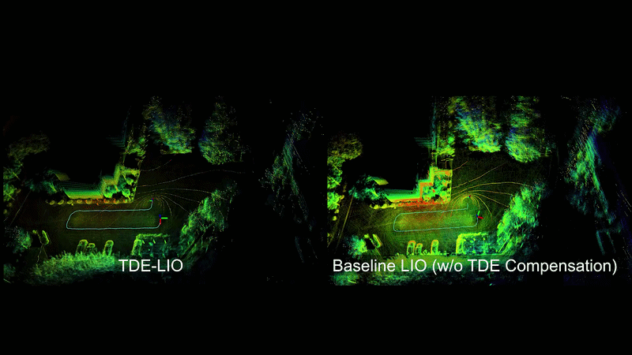
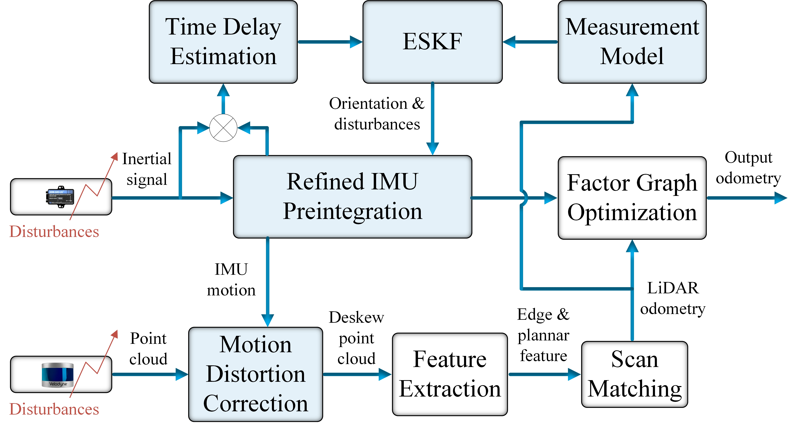
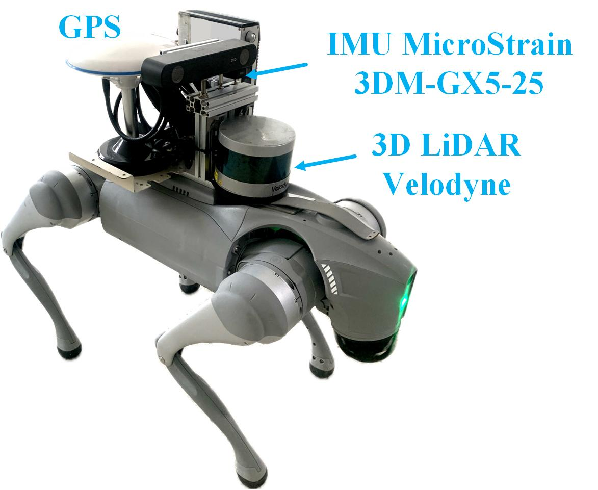
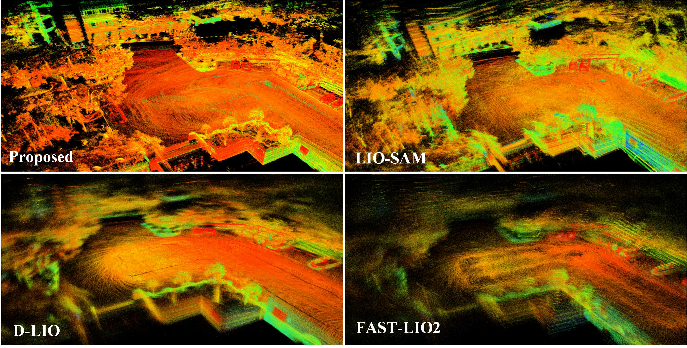
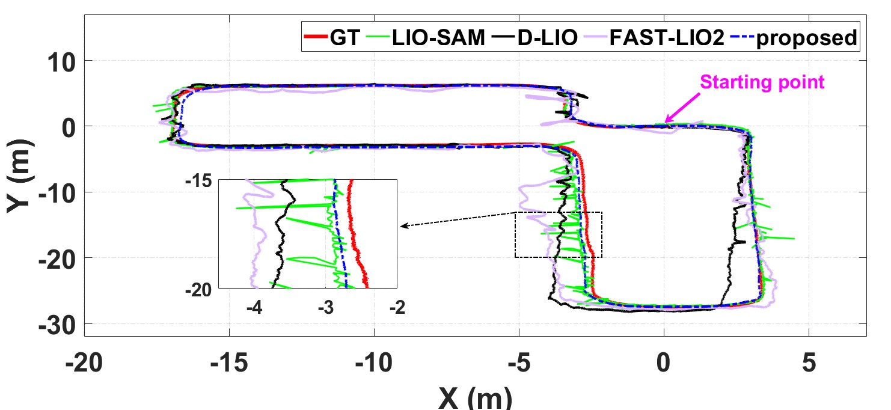

<h1 align="center">TDE-LIO</h1>
<h2 align="center">External Disturbance Compensation for LiDAR-Inertial Odometry under Vibration Conditions on Quadruped Robots</h2>

<p align="center">
  <a href="https://youtu.be/KeZjIlM-DQw">
    
  </a>
  <a href="https://ieeexplore.ieee.org/document/11397344">
    
  </a>
</p>


<p align="center">
  
</p>

---

## Overview

TDE-LIO is a tightly-coupled LiDAR-Inertial Odometry framework designed for quadruped robots operating under severe vibration and fluctuating motion conditions.

Unlike conventional LIO systems that assume clean inertial measurements, quadruped locomotion introduces significant external disturbances through repetitive foot-ground impacts. These disturbances corrupt IMU measurements, degrade IMU preintegration, reduce LiDAR motion compensation accuracy, and ultimately deteriorate odometry performance.

To address this challenge, TDE-LIO introduces an external disturbance estimation framework based on Time Delay Estimation (TDE). The disturbance profile and associated uncertainty are jointly estimated and incorporated into an Error-State Kalman Filter (ESKF). The refined IMU state is subsequently utilized for both IMU preintegration and LiDAR motion compensation, leading to improved robustness, smoother trajectories, and more reliable state estimation under dynamic locomotion.

---

## News
* **2026.06.xx**: Source code released.
* **2026.02.18**: Paper accepted by IEEE Robotics and Automation Letters (RA-L 2026).

---

## Key Features

### External Disturbance Modeling
A Time Delay Estimation (TDE) framework is introduced to characterize unknown disturbances acting on the IMU during quadruped locomotion.

### TDE-Aware ESKF
The IMU orientation and disturbance uncertainty model are jointly updated within an Error-State Kalman Filter.

### Vibration-Robust IMU Preintegration
The compensated IMU measurements significantly reduce vibration-induced degradation in inertial state estimation.

### Improved LiDAR Motion Compensation
The refined inertial pose estimation improves LiDAR deskewing and odometry accuracy.

### Fully LiDAR-IMU Based
The framework operates seamlessly using only:
* 3D LiDAR
* IMU

---

## Prerequisites

Tested on:
* Ubuntu 20.04
* ROS Noetic
* GTSAM

### Dependencies Installation

install **GTSAM**:
 ```
  sudo add-apt-repository ppa:borglab/gtsam-release-4.0
  sudo apt install libgtsam-dev libgtsam-unstable-dev
  ```

---

## Build

Clone the repository into your ROS workspace and build:

```bash
cd ~/catkin_ws/src
https://github.com/HoangHungIRL/TDE-LIO.git
cd ..
catkin_make
```

## Run

1. Launch TDE-LIO:
```bash
source devel/setup.bash
roslaunch tde_lio run.launch
```

2. Play your rosbag dataset in a new terminal:
```bash
rosbag play your_dataset.bag
```

---

## Method Overview

The proposed framework architecture:

<p align="center">
  
</p>

---

## Experimental Platform

### Robot Platform
* Unitree Go2

<p align="center">
  
</p>

### Validation Scenarios
* Indoor environments
* Outdoor environments
* Dynamic locomotion
* Severe vibration conditions

---

## Results

### Mapping Performance
The proposed method significantly improves mapping quality by reducing vibration-induced degradation, resulting in more consistent and geometrically accurate maps during quadruped locomotion.

<p align="center">
  
</p>

---

### Trajectory Comparison
Comparison between:
* LIO w/o TDE Compensation
* TDE-LIO

<p align="center">
  
</p>

---


## Acknowledgments

This project is developed based on the following excellent open-source works. We sincerely thank the authors for making their code publicly available:

* [**LIO-SAM**](https://github.com/TixiaoShan/LIO-SAM)
* [**D-LIO**](https://github.com/vectr-ucla/direct_lidar_inertial_odometry)
* [**ESKF IMU Attitude Estimation**](https://github.com/HoangHungIRL/IMU_filter_IRL_ROS2/tree/ROS-Noetic)

---

## Citation

If you find this work or code useful in your research, please consider citing our RA-L paper:

```bibtex
@ARTICLE{TDE-LIO,
  author={Hoang, Quoc Hung and Kim, Gon-Woo},
  journal={IEEE Robotics and Automation Letters},
  title={External Disturbances Compensation for LiDAR-Inertial Odometry Under Vibration Conditions on Quadruped Robot},
  year={2026},
  volume={11},
  number={4},
  pages={4713-4720},
  doi={10.1109/LRA.2026.3665313}
}
```

---

## Contact

**Quoc Hung Hoang**
* Email: hoanghung21301580@gmail.com  
* For any questions, bugs, or collaborations, feel free to open an issue on this GitHub repository.
